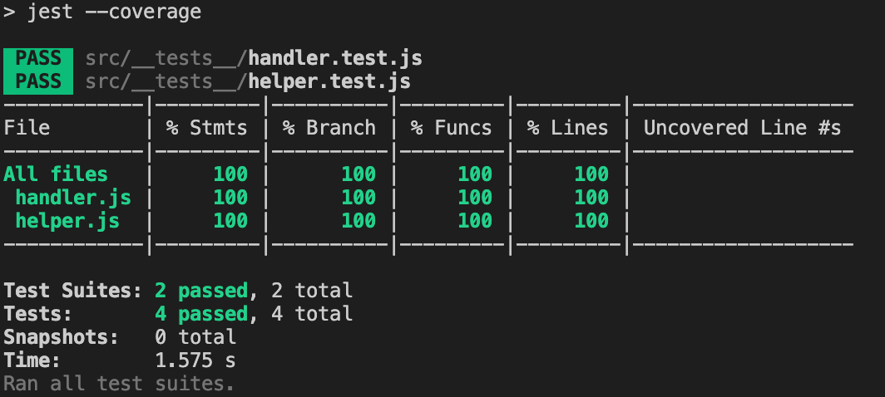

## Monitoring service
Monitoring service allows you to list all security groups for EC2 instances in a AWS account

## Deployment 
Make sure you update the `serverless.yml` file with yout provile under `profile: <<YOUR_AWS_PROFILE>>`

```
sls deploy
```
## Structure 
| File  | Description |
| ------------- | ------------- |
| handler.js  | Main entry point for lambda function using API gateway  |
| helper.js  | Contains helper fucntions to call the aws-sdk and format responses |
| customAuth.js | Produces a policy to invoke the listEC2SecurityGroups function |


## Testing
```
npm test
```

This will generate a code coverage folder in the project directory 

